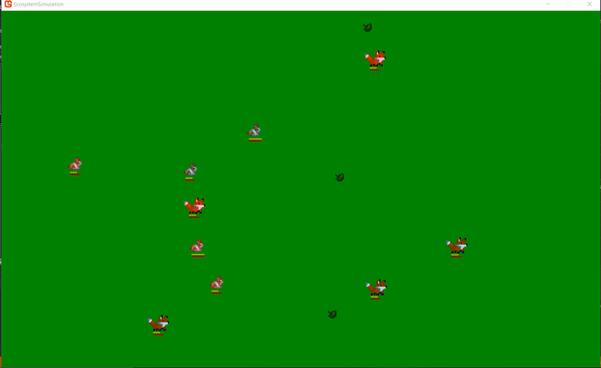
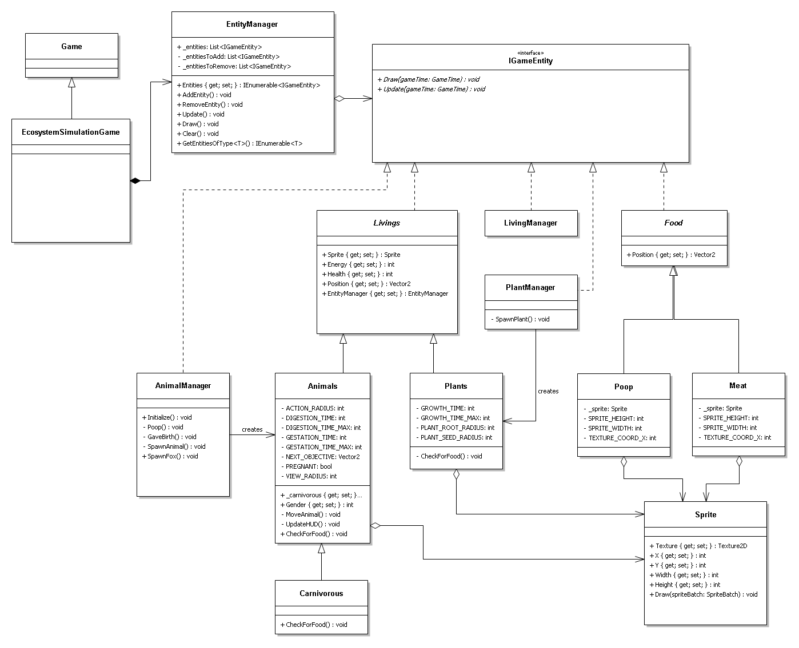
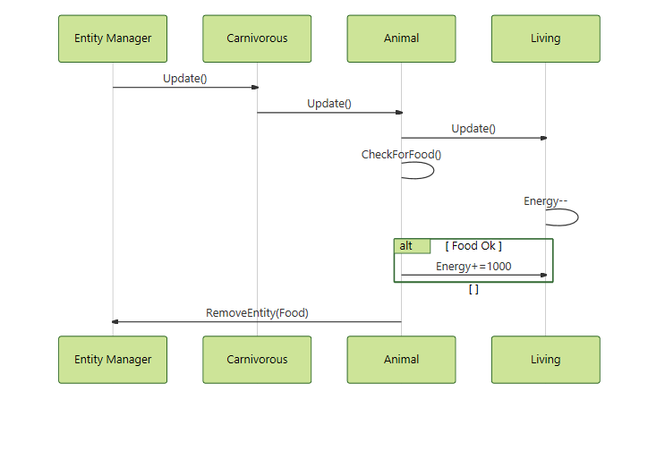

 Quentin Jadoul—Imane Ourraoui

 18155-18316 

 <strong> Game Interface</strong>  

 

 <strong> UML Diagram</strong>  

<strong>Class Diagram</strong> 

<strong>Sequence Diagram</strong>

 <strong> Description des principes SOLID utilisés dans notre projet </strong>  

1. Principe ouvert/fermé :

Le principe ouvert/fermé affirme qu'une classe doit être à la fois ouverte à l'extension et fermée à la modification.

Dans notre objet, nous avons veillé à utiliser l'abstraction. Par exemple, la classe abstraite Living regroupe Animal, 
Plant, puisqu'ils ont une position, une réserve d'énergie et des points de vie. Grâce au polymorphisme par héritage, 
nous définissons les animaux et les plantes en faisant référence à la classe Living. Nous pouvons aussi rajouter autant 
d'animaux sans modifier la classe Living.

2. Principe de Liskov :

L'idée de ce principe est de pouvoir substituer une classe "parente" par l'une de ses classes enfants/dérivées.

Exemple: Le carnivore est une spécialisation de l'herbivore. Soit, un herbivore peut être remplacé par un carnivore s
ans que cela endommage la simulation. Tous deux possèdent les mêmes paramètres générés et configurés de la même manière. 
Le carnivore peut être utilisé comme herbivore sans introduire de modifications dans son fonctionnement.

